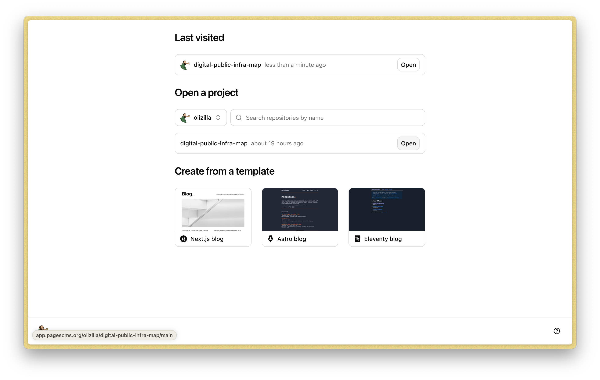
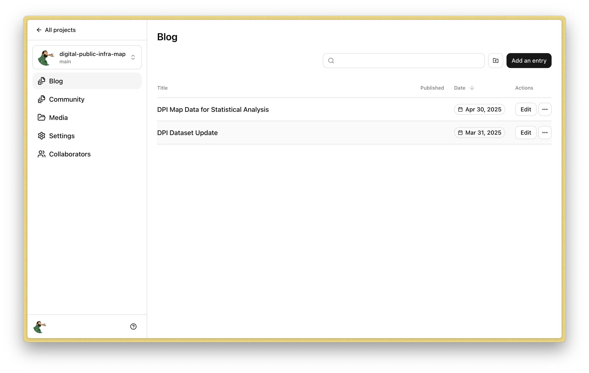
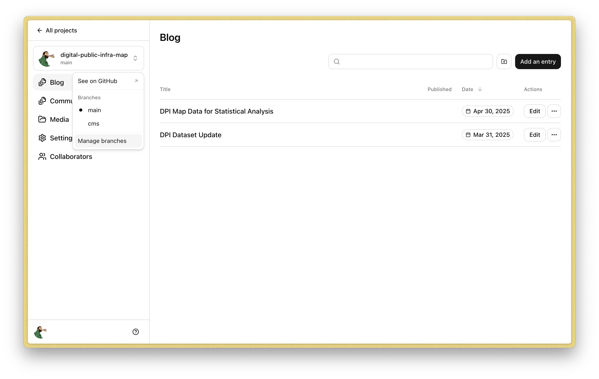
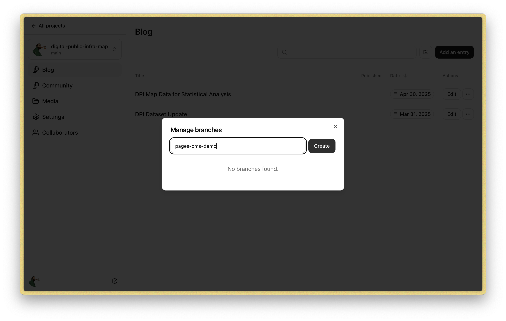
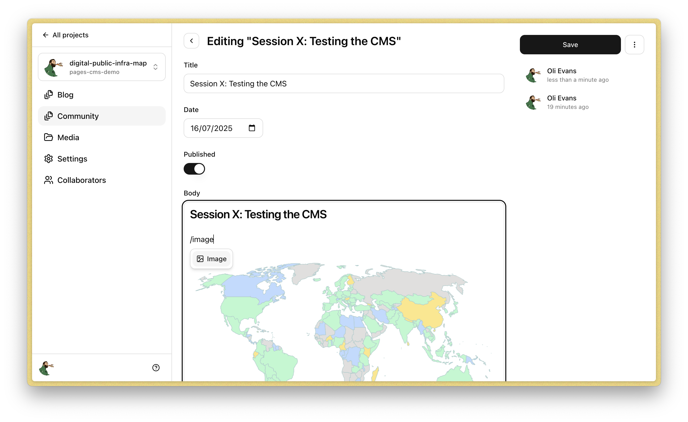
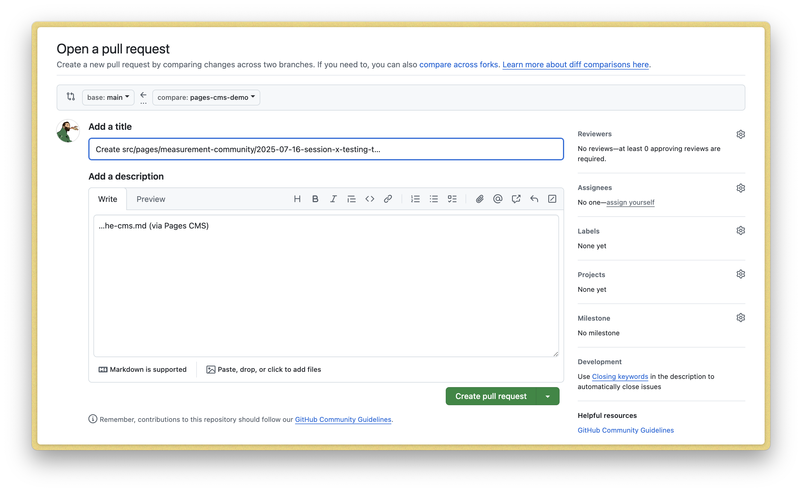
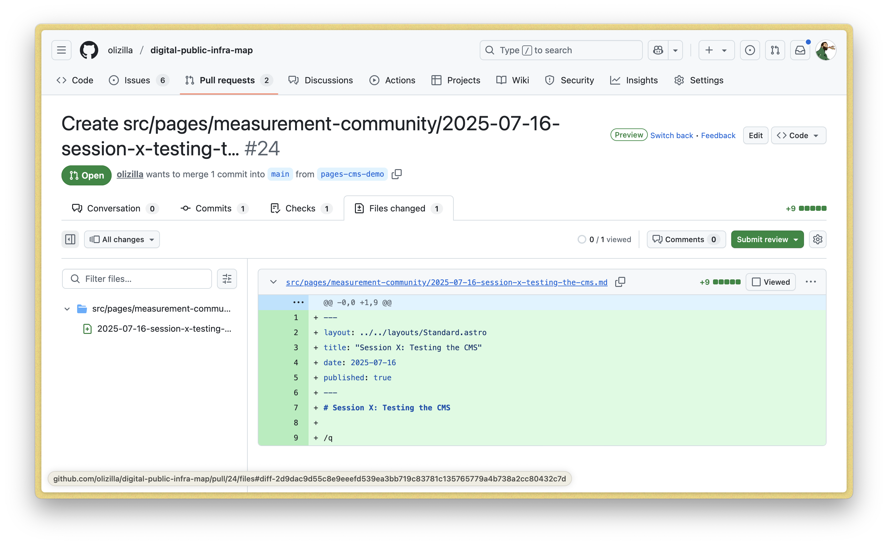
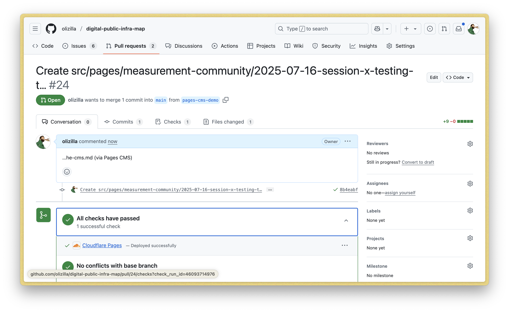
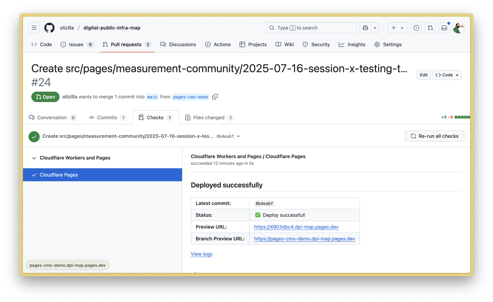
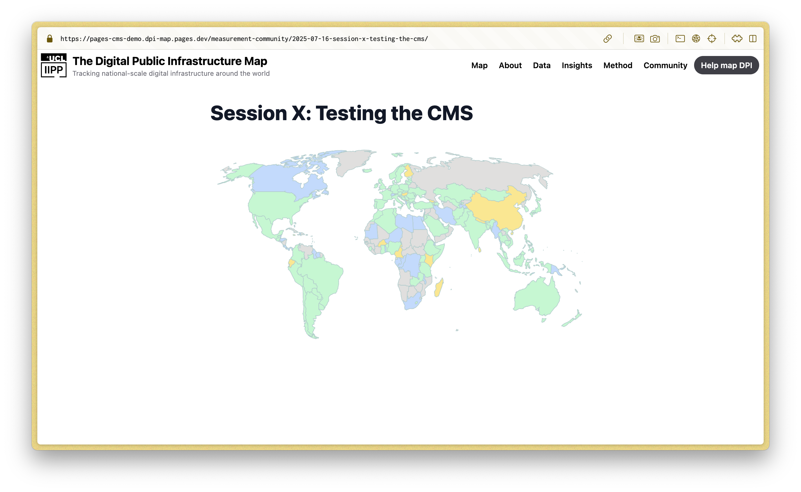

# Contributing to the DPI Map Website.

Contributions are welcome and encouraged! Share information about DPI deployments, provide feedback on our framework, or add to data and build on it. see: https://dpimap.org/contribute-to-the-dpi-map/ 

## Editing the content

First up, know this: The `main` branch on the [github repo](https://github.com/olizilla/digital-public-infra-map) is **the source of truth**. Whatever is there will be built and published to https://dpimap.org by cloudflare pages shortly after an update is pushed to the main branch.

You can clone the repo, and run the website locally on your computer, as described in the [[README.md](https://github.com/olizilla/digital-public-infra-map#getting-started)]. But if you just want to add a new blog post, _easy mode_ is available.

You can add new blog posts and community of practice posts using [Pages CMS](https://pagescms.org/).

_what follows is a walk-thru of using Pages CMS to add a new CoP session page._

First you need a github account, and to get yourself added as a collaborator on the github repo https://github.com/olizilla/digital-public-infra-map so that you have permission to open Pull-Requests (PRs) and edit the repo.

Then log in to Pages CMS using your github log in here: https://app.pagescms.org/sign-in

Find the `digital-public-infra-map` item in the **Open a project** form and click **Open**.



You should now see a side bar with items for **Blog** and **Community** etc.



**Before you start making changes**, create a branch for your work. Otherwise any changes you make will go live on dpimap.org immediately. 

By making a branch you create your own space to make changes and try things out, before asking someone else to review and merge those changes in.

Create a branch by clicking on the `digital-public-infra-map` button at the top of the sidebar and then click **Manage branches**.



Give your branch a name so others can guess what it is for and who is using it. e.g `pages-cms-demo` or `cop-session-july-25` then click **Create**.



To add a new CoP session page, click on **Community** in the side bar and then click **Add an entry** on the left. You get a form where you can set the title of the page and the published date (not currently used, but useful to have), and a **Body** field with a rich text editor. Write the session content in there, and type `/` (slash) to bring up a menu of the different text blocks you can add like Heading 1, Heading 2, Quote, etc.

aside: _Remember that a well structured doc should have a single "Heading 1" at the start and then be divided up by with "Heading 2"s. It rarely helps the reader to further subdivide things with `Heading 3`s and below. This is a blog post not a legal document._



When you are done click **Save**.

To see a preview of your creation click on the `digital-public-infra-map` button in the top left and then click **See on GitHub**, which will take you to back to the repo.

You should see a yellow banner that invites you to create a Pull Request for your changes. Click **Compare and Pull Request**. You'll see a form, where you can provide rich detail the intention behind your changes, (or, accept the defaults), and click **Create pull request**



Now you have a Pull Request, click **Files changed**. Copy the filename of for your new post, and keep it handy. It will be something like 

```
src/pages/measurement-community/2025-07-16-session-x-testing-the-cms.md
```



Now click the **Conversation** tab, and expand the **All Checks have passed** box with the green outline (if the checks do not pass and the box is read, we have bigger problems, and you should call for help!)

Click on **Cloudflare pages**.




Click on the **Branch Preview URL** to jump to a preview build of the dpi map website with your changes built in. 



Now we are going to find your new page using the filename we grabbed earlier.

If the new file you added is

```
src/pages/measurement-community/2025-07-16-session-x-testing-the-cms.md
```

then we want to trim off `src/pages` from the start and the `.md` from the end giving:

```
/measurement-community/2025-07-16-session-x-testing-the-cms
```

Add this on to the url bar for the preview site and hit return to jump to your new page.




