# Global State of DPI

DPI is far more prevalent and widespread than initially believed.

A top-level scan of deployments of identity systems, digital payment systems and data exchange systems across 210 countries has identified:

- **57 Digital identity systems** - which includes those that claim to have an electronic or digital ID in the rollout stage, with an authentication mechanism and at least two sectoral use cases.
- **93 countries with digital payment systems** - which includes those with at least one active digital payment system that facilitates real-time transactions and has a public interest operator. This may comprise cross-domain systems, interbank real-time payment systems, mobile money and CBDCs.
- **103 Data exchange systems** - which includes those with a cross-sectoral, national-level and active data exchange system. This can range from internal platforms facilitating data sharing within government departments, to systems connecting multiple agencies and authorised third parties to share data crucial to public service delivery. 

A clear definition of DPI is key to enhancing its measurement and unlocking its potential.

## Digital identity

Out of 210 countries researched, 164 (subset 1) claim to have a digital or electronic ID system. Of these, only 56% (93 countries, subset 2) are in the rollout stage, indicating that while many claim to have digital identity systems, fewer can be considered to be implemented.

Within subset 2, 87 countries have an authentication mechanism. 

Finally, only 57 countries of the final subset have been operationalised across two sectoral use cases. 
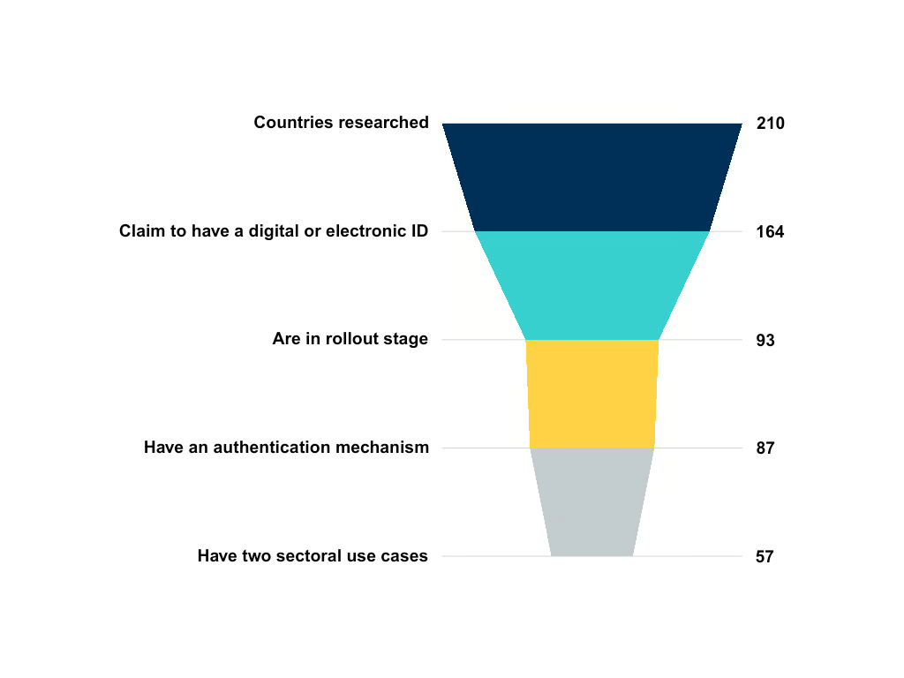

<aside>

The first two conditions of this funnel – whether a country claims to have a digital ID system, and whether it is in the rollout stage – are considered crucial to our articulation of digital Identity systems as DPI. The analysis below treats this subset (of 93 digital identity systems) as the primary sample for analysis.

</aside>

**Approaches to designing digital identity systems are not homogeneous.** Among those countries where digital ID systems have been implemented (i.e. in the rollout stage), 75% have regulations that codify the state of digital identity and provide some rules on its scope and use.

From this subset of countries where digital ID is operating, and which have regulations that codify the state of digital identity, still 11% don't have a Data Protection Act in place.

Insights on the institutional arrangements that house digital identity programs make the heterogeneity even more evident. Nearly 33% of countries manage their identity systems through a dedicated ID or Registration Authority, 28% by Digital Governance bodies, and 22% by Security and Protection institutions.

  <figure>

  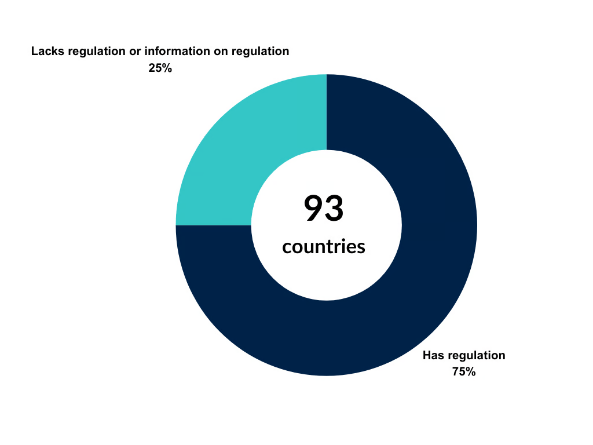

  <figcaption>
  From the countries in rollout stage, 75% have specific regulation on digital IDs and 25% have no regulation or no specific data regarding digital ID regulation.
  </figcaption>
  </figure>
  <figure>

  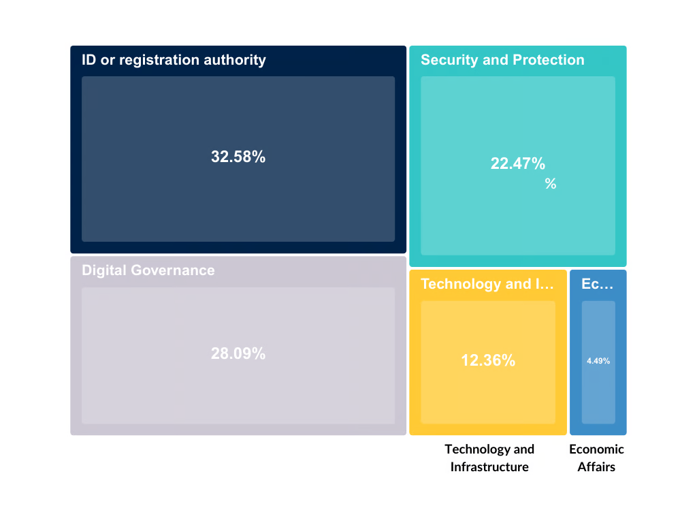

  <figcaption>
  Governance is dominates by ID or registration authorities, followed by Digital Governance bodies. Fewer countries (4%), put their digital identity systems under the umbrella of Economic Affairs institutions.
  </figcaption>
  </figure>

## Digital payment

Payment systems are highly variable across the domains they engage with (banks only, mobile-only, digital currency, or a mix of these). While it is more intuitive to think of one of these payment systems as DPI, they all facilitate real-time transactions at the user level (even if settlements between banks or payment system providers may not be in real-time). Independently and in combination, they all facilitate financial inclusion and economic growth.

<aside>

Data on digital payment systems looks for cross-domain payment systems, interbank and mobile money payment systems, and CBDCs in that order. Across 210 countries, 249 payment systems have been researched.

</aside>

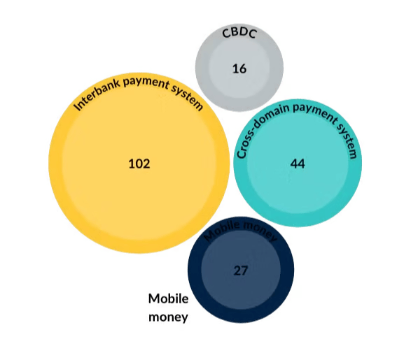

Interbank payment systems are most the most prevalent real-time payment system, followed by cross-domain payment systems, mobile money and CBDCs. This includes payment systems that are both active or planned, with all types of operating models.

  <figure>

  

  <figcaption>
  Of 249 payment systems studied across 210 countries, only 44 of them were cross-domain i.e. permitting participation across bank and non-bank participants.
  </figcaption>
  </figure>
  <figure>

  

  <figcaption>
  Of 210 countries, only a third had payment-system interoperability policies that incentivised cross-domain real-time transactions.
  </figcaption>
  </figure>

While 132 countries are identified to have active and real-time payment systems, fewer of these (93 countries, subset 1) have public-interest governance structures. These include those operated by central banks or bank associations.

Furthermore, even fewer (27%) of these countries (subset 1) had payment systems that operated across domains. These included payment systems that allowed participation from both banks and non-banks.

<aside>

To analyse payment systems as DPI, a subset of 93 countries have been regarded as a primary sample. This includes countries whose payment systems have at least one active real-time payment system, with some public-interest governance.

</aside>

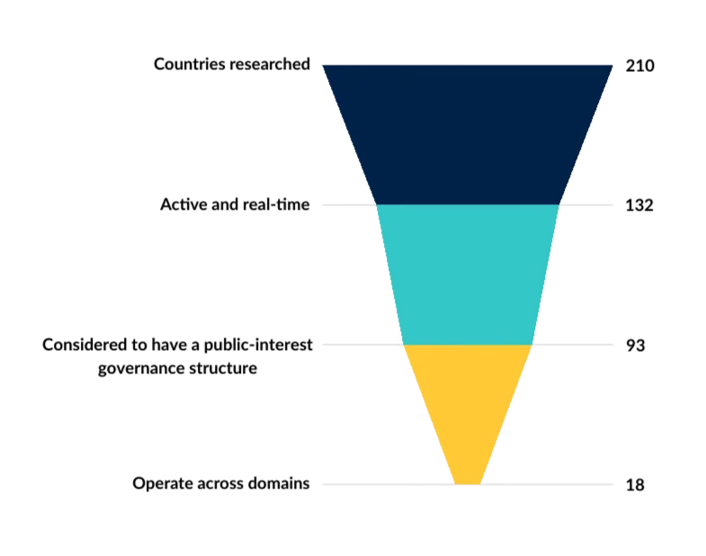

## Data Exchange

103 countries are identified to have an active data exchange system that operates at a national or federal level, allowing public sector entities to share data with peers or with authorised entities towards public service delivery. Countries with sectoral data exchanges were excluded from this analysis.

**Data exchanges are the least studied of all DPI components – with good reason.** Of the 103 active data exchange systems identified, there was variable information shared about how the data exchange functioned.

When scrutinising for information on the base technical architecture (such as X-Road, API Gateway), the capacity for semantic and technical interoperability (to enable integration with various data formats and technologies), and the availability of clear guidelines for enrolment (essential for scaling operations), 67 systems provide comprehensive information on these key aspects.

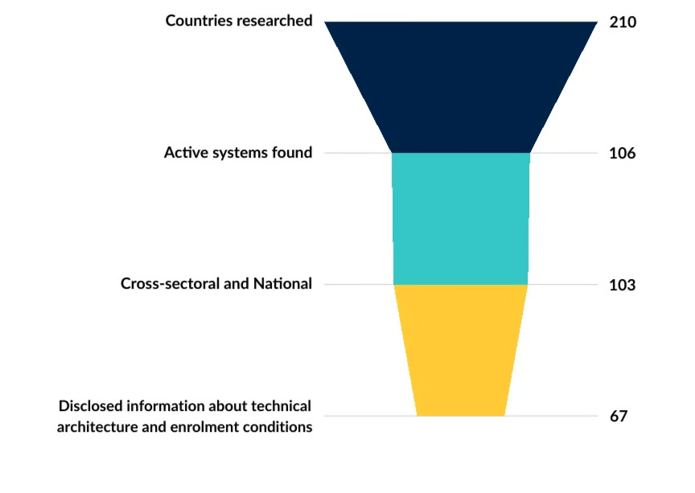

---

Across the globe, digital identity, digital payment, and data exchange systems are thriving. Countries at every income level showcase unique and compelling DPI narratives.

## Digital Identity

**Eight out of ten high-income countries have implemented digital ID systems.** Of these, 49% have fully rolled them out, making evident how high income countries are likely to have advanced in their digital identity system deployments. However, the gap between high-income and middle-income countries is smaller than expected, with middle-income countries having rollout rates around 20%. This indicates that while income matters, other factors might influence the pace of digital ID deployment.
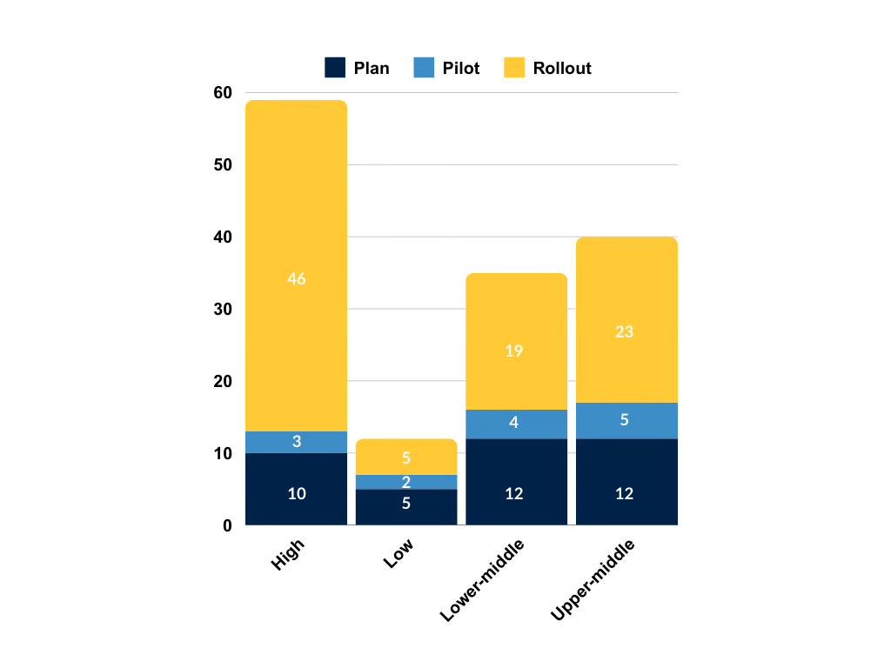

## Digital payment

**When digital payment systems across countries of different income levels are compared, we find surprising insights.** Comparing the state of interbank payment systems and cross-domain payment systems, we confirm common intuition. Firstly, that interbank payment systems are most popular and secondly, that both types of payment systems decrease across income level groups.

However, when comparing these against a subset of payment systems that are operated by a central bank, we find that the number of payment systems fall starkly across middle and low income country groups, and altogether disappearing for low-income countries. This is likely because a number of them are regional payment systems whose status of implementations we are not aware of, or have domestic payment systems that are still in planning stages. Irrespective, non-central bank operators seem to play a dramatic role in payment system operations across middle and low income country groups.

  <figure>

  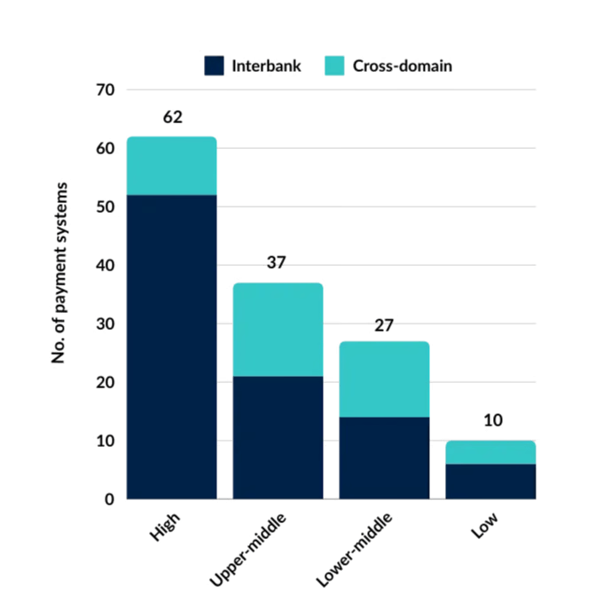

  <figcaption>
  Payment systems with diverse operator models
  </figcaption>
  </figure>
  <figure>

  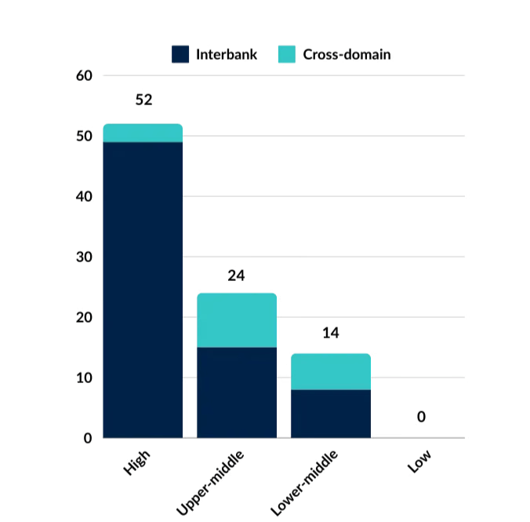

  <figcaption>
  Payment systems with central bank as operator
  </figcaption>
  </figure>

### Data exchange

Ninety-seven 'Active' national and cross-sectoral data exchange systems were found to disclose information on the type of Coordination Unit overseeing their operation. The analysis was conducted by categorising these units into four groups:

- **Digital Government**: Units responsible for modernizing government services, implementing e-government initiatives, and transforming public administration through digital means (e.g., Togo Digital Agency, Agency for Digital Development, e-Government Authority).
- **Data Management and Data Departments**: Units primarily focused on data governance, management, security, and technical infrastructure for data exchange (e.g., Federal Statistical Office, Office of the National Data Commissioner).
- **Communications, Transport, Science and Technology or ICT**: Agencies tied to telecommunications, infrastructure, and transport (e.g., Ministry of Information and Communication Technology, Government ICT Authority).
- **Other**: Ministries of Economy, Finance, Public Administration, or executive offices.

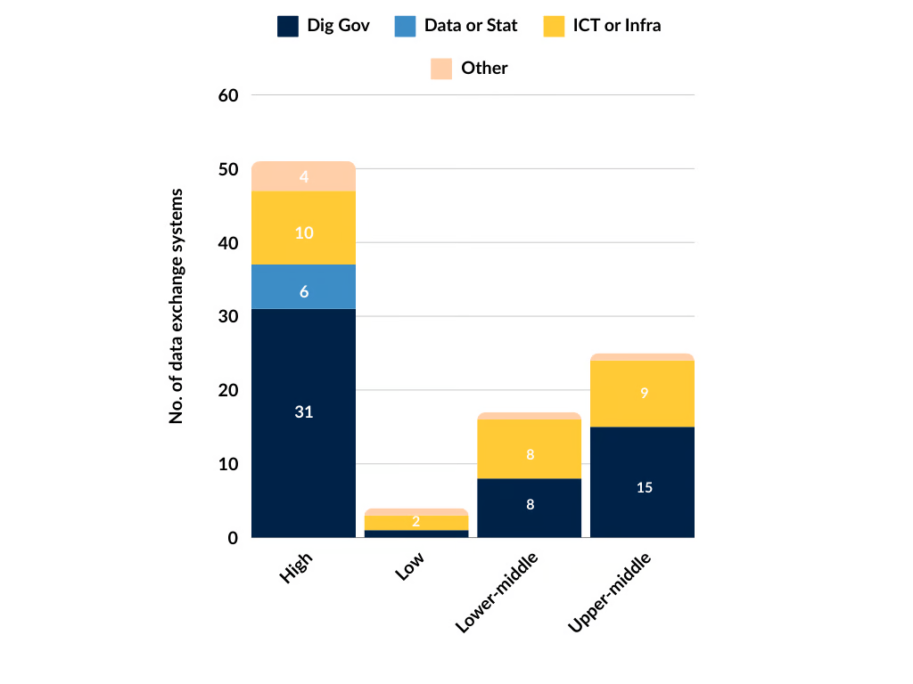

**Regardless of income classification, over half of these systems are found to be managed by units associated with Digital Government (e.g., digital transformation, digitisation, e-government)**. This trend indicates a global perspective that positions data exchange as a component of Digital Public Infrastructure (DPI), under the purview of specialised units, rather than as a matter for Telecommunication or Infrastructure agencies (29 countries), and even less so for Data Management or Statistics departments (6 countries).

---

Distinct regional patterns in system deployments are undeniably shaping the global DPI landscape.

## Digital Identity

**Europe and Asia have the most advanced digital identity deployments.** Europe stands out with 35 systems in the rollout stage. Asia also shows a significant presence with 20 systems already in rollout. While Africa claims the highest number of digital IDs, with 54 cases, it's important to note that nearly half of these are still in pilot or planning stages, indicating that much of the continent's DPI initiatives are still in early phases.

<figure>

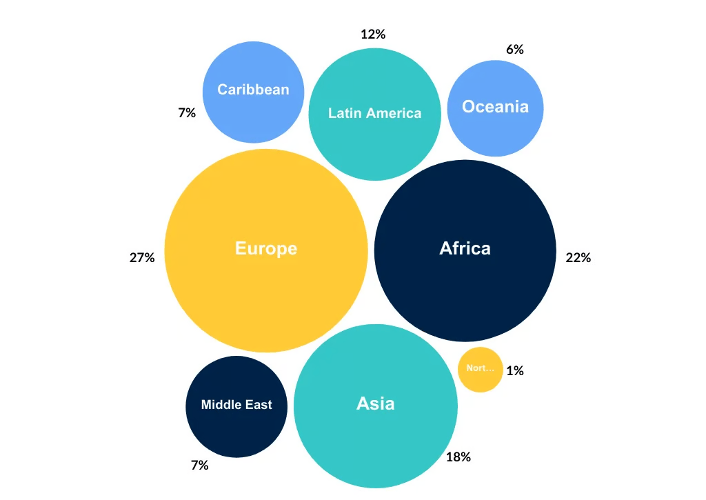

<figcaption>Regional distribution of countries which claim to have digital ID and are in either planning, pilot or rollout stages.</figcaption>
</figure>

## Digital payment

Regional differences in the implementation of payments DPI are predictable. Economically advanced regions display a picture perfect DPI for payments story – 100% of their payment systems that are operated by a central bank are active. Regions like Latin America, the Caribbean, Middle East and Asia are not too far behind. However, **public-interest and active payment systems in Africa and Oceania seem to have a significant number of their payment systems that could count as DPI stuck in pilot or planning stages.**

<figure>

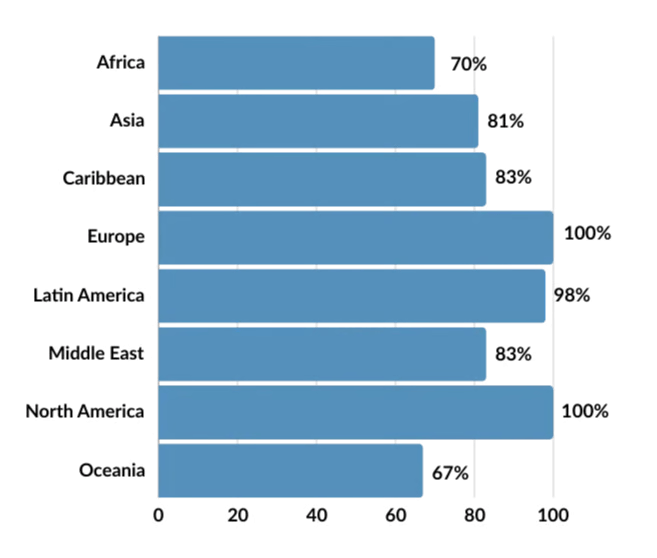

<figcaption>
Proportion of payment systems across regions that are operated by a central bank and active.
</figcaption>
</figure>

## Data exchange

Of the 103 countries with an active data exchange system, **61 revealed information about the technical architecture their system leverages**. Among these, API Gateway, X-Road, and Enterprise Service Bus (ESB) are the most commonly reported technical architectures, with Unified eXchange Platform (UXP) by Cybernetica following. Notably, the X-Road model shows a strong presence in regions like Africa, Asia, and Europe, indicating its adoption in regions that prioritise secure, interoperable frameworks for cross-sectoral data sharing. Meanwhile, the API Gateway model is more commonly used in North America and Latin America, with some presence in Europe, reflecting a preference for customizable and flexible API management solutions in these areas.

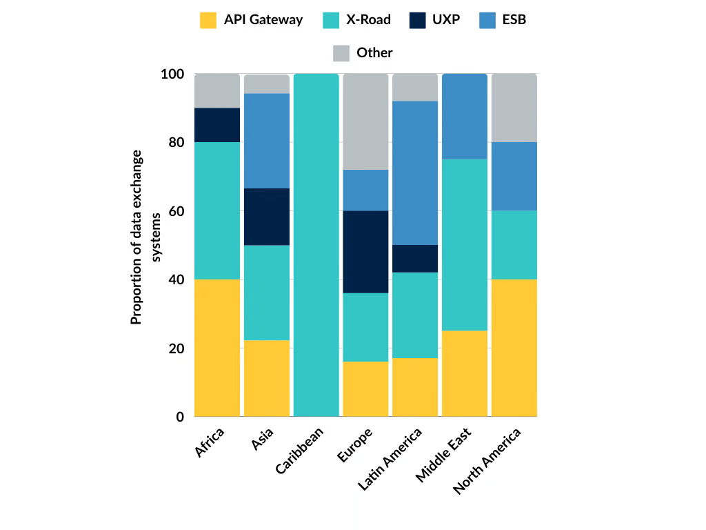

In addition, some tailor-made architectures, as well as solutions from private companies, are found primarily in Europe, showing that certain countries are opting for bespoke or proprietary systems to meet their unique data exchange needs. Furthermore, many of the other architectures identified seem to exist but are not in operation yet, reflecting the evolving landscape of technical choices in these countries. 

---

## Citation

Global State of DPI (Oct 2024). Institute for Innovation and Public Purpose, UCL. [https://dpimap.org](https://dpimap.org/)

## Next steps

[Help map DPI](/contribute-to-the-dpi-map) and join the [Community of Practice](/measurement-community)

View the slide deck [here](https://docs.google.com/presentation/d/1sENtmoYbbRXvXPzWXmRkwNGrYmIy_cGC2eWbEt3u0po/edit?usp=sharing)

DPI is fast-evolving. Keep in touch with the DPI story by subscribing to our newsletter [here](https://docs.google.com/forms/d/1d3cBkoS8YBBhtqrKsuLf1Co1KJlO-VcleOFc1bBaHjQ/viewform?edit_requested=true).
