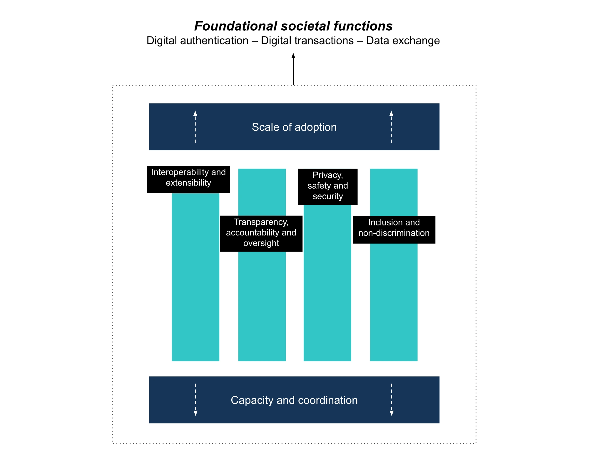
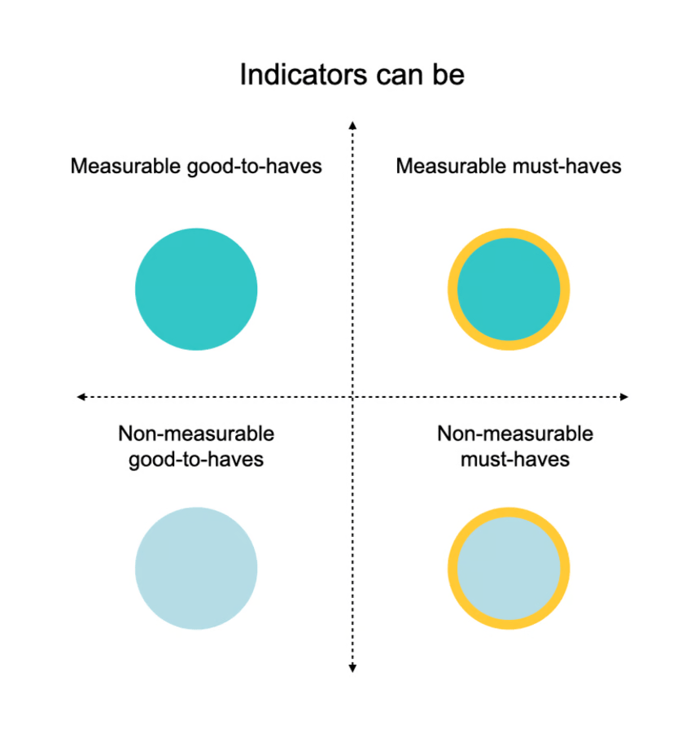

# Methodology

The DPI Map collects data based on a framework explained below. This framework provides a comprehensive view of the technical and governance characteristics of DPI, studying DPI through a set of attributes and indicators. Given its desk-based data collection methods, the DPI Map gathers data on a limited number of these indicators.

  <a href="https://bit.ly/dpimapframe" class="button-blue">
    Download the PDF
  </a>

## DPI Conceptualisation and Measurement Framework

As governments, multilateral actors, and technology implementers collaborate towards making DPI a reality across the globe, the DPI Map asks: ***how prevalent is DPI across the planet?***

To answer this, we had to wrestle with some fundamental issues. How does one define DPI as a concept? How do you translate any definition into foundational qualities that can be objectively measured across different national contexts around the world? This piece seeks to explain our approach in addressing these questions, to enable researchers, technical advisors, policymakers and advocates to understand the context of this data set and its limits, so they can effectively use it in their work.

<aside>

**Digital public infrastructure** is [understood](https://medium.com/iipp-blog/what-is-digital-public-infrastructure-6fbfa74f2f8c) as "society-wide, digital capabilities that are essential to formal participation in society and markets as a citizen, entrepreneur, and consumer in a digital era."

</aside>

**The resulting ‘Measuring DPI Framework’, offers a first take on translating the normative concept of DPI into a measurable framework** to evaluate real-world implementations. The framework has **two layers** _(see illustration below)_. The framework was developed through iterative consultations with experts spread across technical and governance subject matter areas.

The first layer of the framework is inductive. It proposes a set of normative **attributes,** a set of common technological and governance qualities that describe how DPIs _should_ be designed. The second layer is deductive. It is composed of a set of **outcome indicators that** describe how attributes can be realised in real-world deployments.

The framework identifies **six attributes**

These attributes describe the qualities that define artefacts - like digital identity systems - as public (and not private) infrastructures. In addition to the four attributes, an essential condition to implementing DPI is the supportive ecosystem capacity and coordination capability. A final component for assessing DPI’s attributes is through the adoption of DPI, or the extent to which actors other than the DPI operator leverage the DPI.

These attributes should be read in framing DPI as the means to serve foundational societal functions in the digital age, namely digital authentication, digital transactions and the exchange of data.

<aside>

The following DPI components are [treated](https://medium.com/iipp-blog/what-is-digital-public-infrastructure-6fbfa74f2f8c) as fundamental to a country’s DPI infrastructure, and form the primary focus of this project. Nevertheless, we acknowledge that this list may expand as countries progress in their respective journeys towards sophisticated DPI.

 _**Digital ID**_: A secure, interoperable system that includes digital authentication (not just enrollment) to access services provided by both public and private sector actors. 
 
 _**Digital Payment**_: An interoperable, open-loop system that securely connects banks (money custodians), payment rails (routes the payment messages) and front-end payment applications (apps and fintechs) for end-users. It is ideally instant (i.e. instant retail payment system). 
 
 _**Data Exchange**_: An interoperable system that enables individuals and public and private sector entities to exchange and digitally verify data with one another securely.

</aside>

To assess the attributes of real-world deployments, the DPI Mapping team had to determine: how do we know if DPI is interoperable? Do we look at its technical standards, or whether the architecture is made accessible through documentation? Or both?

The resulting set of **outcome indicators** sought to elaborate on the attributes by describing effective norms, rules, technologies and processes observed in real-world deployments and suggested by expert practitioners and area specialists (e.g. privacy and security experts).

Each foundational DPI (i.e. ID, payments, data exchange) has both unique and shared indicators. (38 for ID, 20 for payments, 20 for data exchange).

It’s worth mentioning that **not all indicators are equal.**

In version 1.0 of this framework, we present an exhaustive version of indicators for all attributes. These indicators however can be divided into subjective and objectively measurable (based on our data scoping methods, accessible here). We further divided indicators into two other categories: ‘must haves’ referred to indicators that more directly assessed the essence of an attribute, while ‘good to haves’ reflected those that did so more indirectly or partially. In an effort to both be more objective and make effective use of our limited resources, version 1.0 of our map collects data on only measurable must-have indicators.

We purposely share all the indicators we derived for several reasons. First, we hope users and contributors might suggest edits that would shift non-measurable indicators into being measurable. Second, that our list of indicators might inform others’ research. And third, just because an indicator is non-measurable does not mean it is not important. We hope that policymakers and DPI developers will find all our indicators useful when developing or deploying DPIs.

## Using the framework

We hope that researchers, policymakers, technical advisors, and advocates will use this framework to advise and inform the measurement of DPI as a concept. A complete list of works consulted directly or indirectly in developing this framework will be accessible in our upcoming whitepaper. Feedback is welcome and will be integrated with subsequent versions.

Download the framework (.xls) [here](https://docs.google.com/spreadsheets/d/1-G3Jmo85tABaBLyg1UPXtzUKK8NK3VH4/edit?usp=sharing&ouid=109666902899934821981&rtpof=true&sd=true).

Download the codebook to understand how the Map uses this framework [here](https://docs.google.com/spreadsheets/d/1JbpmZ1ap235wVCTcnA1dE5ghCWEzdFJXxyZz1FTRupk/edit?usp=sharing).

Download the PDF [here](https://bit.ly/dpimapframe)

### Citation

Eaves, D. and Rao, K. (2025). Digital Public Infrastructure: a framework for conceptualisation and measurement. UCL Institute for Innovation and Public Purpose, Working Paper Series (IIPP WP 2025-01). Available at: https://bit.ly/dpimapframe

## Data collection methodology

The [DPI Map](https://dpimap.org/dpi-map) puts the ‘Measuring DPI’ framework to the test, reporting a mix of data points from publicly accessible data sources. Typically, these sources include government-reported updates through their websites, press releases, as well as data from other third-party reporters (World Bank, UN, regional development banks, regional technical capacity-builders).

Since the release of the first version of our Map, we have also received data from country-level implementers and advisors, on the state of their country’s DPI. These have since been validated and included in the dataset as well.

